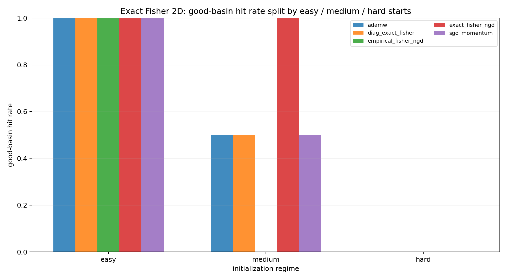
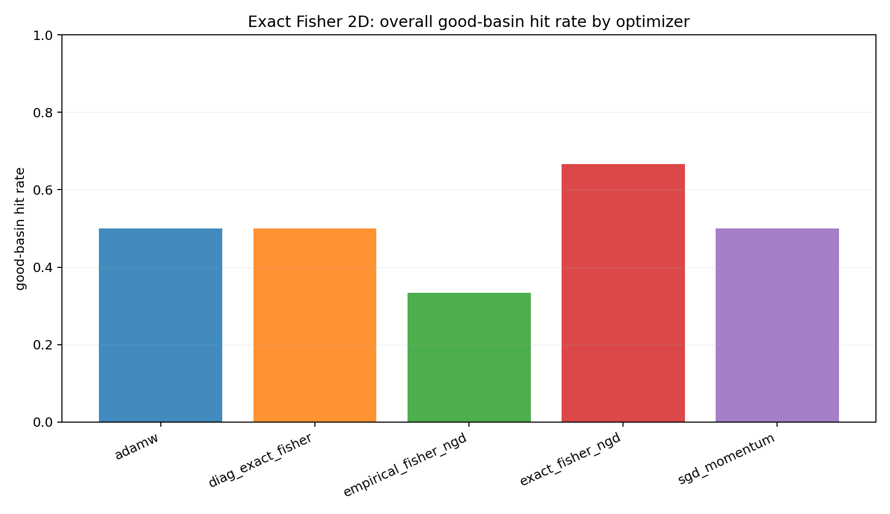
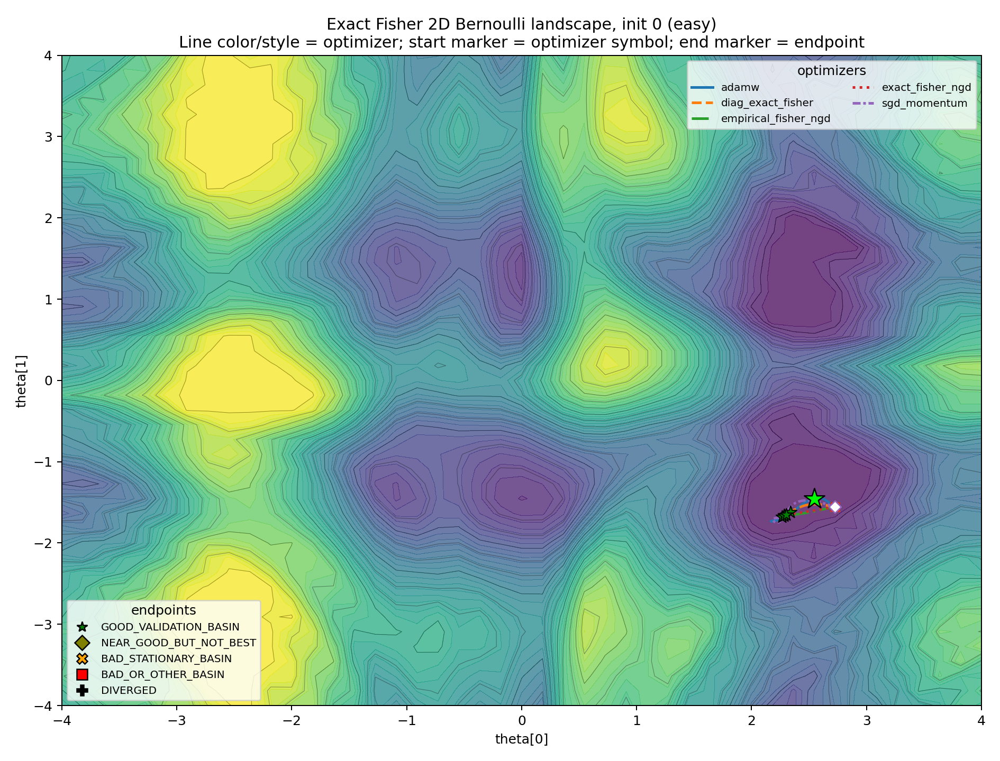
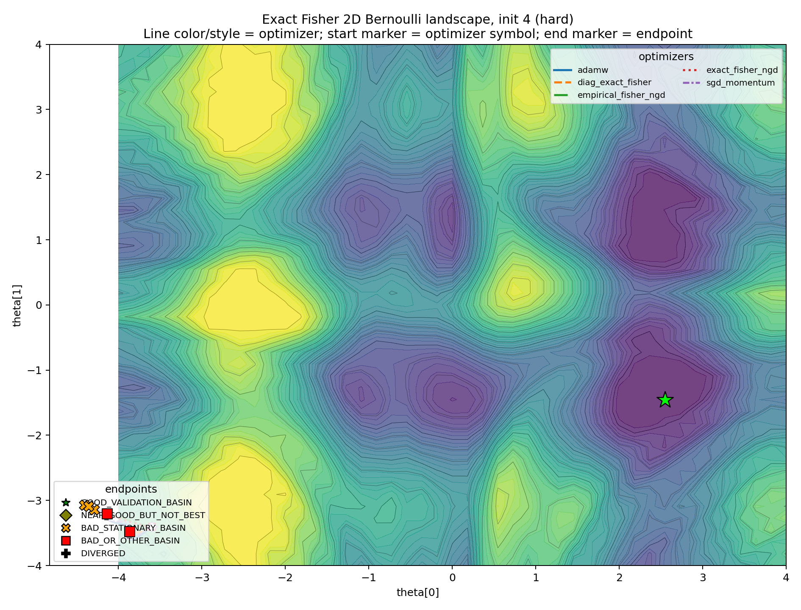
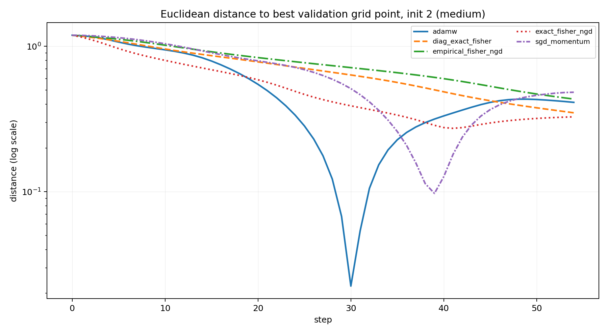

<style>
.article-figure {
  max-width: 760px;
  margin: 1.35rem auto 1.75rem auto;
}
.article-figure img {
  width: 100%;
  height: auto;
  display: block;
  margin-left: auto;
  margin-right: auto;
  border-radius: 4px;
}
.article-figure figcaption {
  margin-top: 0.55rem;
  font-size: 0.92rem;
  line-height: 1.35;
  color: var(--bs-secondary-color, #666);
  text-align: left;
}
</style>

*Status: research note; not peer reviewed. The Fisher-geometry facts are standard; the experiments are small edge cases about local preconditioning and non-convex basin selection.*

## Preface

Natural gradient descent has a beautiful geometric story. Ordinary gradient descent measures a step in the coordinates in which the parameters happen to be written. Natural gradient descent instead measures a step by the change it induces in the model distribution.

The local ruler is the Fisher information matrix. For a parametric predictive model $p_\theta(y \mid x)$,

$$
F(\theta)
=
\mathbb{E}_x\,\mathbb{E}_{y\sim p_\theta(\cdot\mid x)}
\left[
\nabla_\theta \log p_\theta(y\mid x)
\nabla_\theta \log p_\theta(y\mid x)^\top
\right].
$$

The damped natural-gradient step is

$$
\theta_{t+1}
=
\theta_t
-
\eta\left(F(\theta_t)+\lambda I\right)^{-1}
\nabla_\theta L(\theta_t).
$$

This is the right object to study if the question is information geometry rather than merely curvature. A Hessian-preconditioned method may be useful, but it is not natural gradient unless the Fisher metric is actually computed or approximated.

The point of this note is narrow:

> A correct local Fisher metric does not guarantee selection of the globally desirable basin in a multimodal non-convex likelihood.

This is not an argument that natural gradient or K-FAC is bad. It is an argument about what local geometry can and cannot promise. Fisher information gives a local geometry on a statistical model. It is not, by itself, a global map of the validation landscape.

## Part I: The information-geometric view

Let $P_\theta$ denote the probability law induced by the model. If $\theta$ and $\theta+d\theta$ are close, then

$$
\operatorname{KL}\left(P_\theta\,\|\,P_{\theta+d\theta}\right)
=
\frac{1}{2}\,d\theta^\top F(\theta)d\theta
+
o\!\left(\|d\theta\|^2\right).
$$

Thus $F(\theta)$ is the metric tensor associated with infinitesimal KL distance. A displacement $v$ in parameter space has squared statistical length

$$
\|v\|_{F(\theta)}^2
=
v^\top F(\theta)v.
$$

Natural gradient is the steepest descent direction under this Fisher geometry. Equivalently, it is the solution of the local trust-region problem

$$
\min_{\Delta}
\left\{
\nabla L(\theta)^\top \Delta
+
\frac{1}{2\eta}\Delta^\top F(\theta)\Delta
\right\}.
$$

When $F(\theta)$ is nonsingular, the solution is

$$
\Delta_{\mathrm{NG}}
=
-\eta F(\theta)^{-1}\nabla L(\theta).
$$

This form makes both the promise and the limitation visible. The Fisher matrix tells us which infinitesimal steps are large or small in distribution space. It does not tell us which faraway basin has better validation loss.

### An information-geometric view

There is also a useful Hilbert-space way to read the same formula. For a dominated model with density $p_\theta(z)$, write the score as

$$
s_\theta(z)
=
\nabla_\theta \log p_\theta(z).
$$

Under regularity conditions,

$$
\mathbb{E}_{P_\theta}\left[s_\theta(Z)\right]=0,
$$

so each score component is an element of the mean-zero space $L^2_0(P_\theta)$. The Fisher matrix is the Gram matrix of these score functions:

$$
F_{rs}(\theta)
=
\left\langle
\partial_r\log p_\theta,
\partial_s\log p_\theta
\right\rangle_{L^2(P_\theta)}.
$$

A parameter velocity $v\in\mathbb{R}^p$ maps to the tangent random variable

$$
z\mapsto v^\top s_\theta(z),
$$

and its squared norm is

$$
\mathbb{E}_{P_\theta}
\left[\left\{v^\top s_\theta(Z)\right\}^2\right]
=
v^\top F(\theta)v.
$$

So natural gradient is not just “rescaling by a matrix.” It is steepest descent after measuring parameter motion by the $L^2(P_\theta)$ norm of the induced score perturbation.

But the inner product is taken under the current model $P_\theta$. It describes infinitesimal motion around the current distribution, not the global topology of the loss surface. The experiment below is designed to make that local/global distinction visible.

## Part II: The experiment

The experiment uses a two-parameter Bernoulli model

$$
p_\theta(y\mid x)
=
\operatorname{Bernoulli}\!\left(\sigma(f_\theta(x))\right),
\qquad
\theta\in\mathbb{R}^2.
$$

The logit $f_\theta(x)$ is nonlinear in $\theta$, so the validation surface over $(\theta_1,\theta_2)$ can have multiple basins. The model is intentionally small: small enough to draw the surface and compute the exact Fisher matrix.

For a Bernoulli logit model, let

$$
p_i(\theta)=\sigma(f_\theta(x_i)),
\qquad
J_i(\theta)=\nabla_\theta f_\theta(x_i).
$$

The exact model Fisher on the training inputs is

$$
F(\theta)
=
\frac{1}{n}\sum_{i=1}^n
p_i(\theta)\left\{1-p_i(\theta)\right\}
J_i(\theta)J_i(\theta)^\top.
$$

This is not a Hessian proxy. It is the Fisher matrix of the predictive Bernoulli model.

I compare five optimizers:

1. AdamW;
2. SGD with momentum;
3. exact Fisher natural gradient;
4. empirical Fisher natural gradient;
5. diagonal exact Fisher.

The initializations are separated into three regimes:

- **Easy** starts are positive controls. The good validation basin is nearby, and all methods should have a fair chance.
- **Medium** starts are ambiguous. The good basin is reachable, but the trajectories can differ.
- **Hard** starts are adversarial. They are included to expose failure modes, not to suggest that every start is equally reasonable.

This split matters. Without positive controls, the experiment would only say that the surface is hard. With easy, medium, and hard starts separated, the question becomes sharper: when the good basin is reachable, does Fisher geometry reliably select it?

### Endpoint classification

The endpoint labels are defined on the validation landscape. A run is counted as successful only if its final point lands in the good validation basin: the basin containing the best validation grid point. Endpoints that converge to other stable regions, or to stationary regions outside the good basin, are not counted as successes.

This is an empirical basin classification, not a theorem. It is deliberately stricter than reporting final training loss. The question is not whether the optimizer made progress. The question is whether it selected the basin we wanted.

## Part III: Success rates by regime

The first figure summarizes the endpoint classification.

<figure class="article-figure">
  
  <figcaption>Good-basin hit rate by initialization regime. Easy starts are positive controls; medium starts are the informative regime; hard starts expose failure modes.</figcaption>
</figure>

The easy starts show that the task is not broken. Natural gradient, AdamW, SGD, and the diagonal Fisher method can all reach the good basin when the start is favorable.

The medium starts are more informative. The good basin is reachable, but not all methods select it from every ambiguous start. This is where the slogan is tested: a locally correct Fisher metric need not encode the global basin structure.

The hard starts are stress tests. They should not dominate the interpretation, but they show that local preconditioning can still be pulled into an undesirable attractor.

Aggregating over all starts gives a compact comparison, but it should be read only after the regime split.

<figure class="article-figure">
  
  <figcaption>Good-basin hit rate by optimizer, pooled over the balanced easy, medium, and hard starts.</figcaption>
</figure>

The pooled number is secondary. The more important observation is regime dependence: no optimizer here turns local geometry into a global basin-selection guarantee.

## Part IV: The trajectories

The level-set plots make the basin story more concrete. Line color and line style identify the optimizer. The final marker identifies the endpoint class.

The easy case is the sanity check.

<figure class="article-figure">
  
  <figcaption>Easy initialization. All methods reach the good validation basin.</figcaption>
</figure>

This plot prevents the experiment from becoming an anti-natural-gradient caricature. Exact Fisher NGD can work. The geometry can be helpful.

The medium cases are the real diagnostic.

<figure class="article-figure">
  
  <figcaption>Medium initialization. The good basin is reachable, but the selected basin depends on the optimizer and the induced trajectory.</figcaption>
</figure>

<figure class="article-figure">
  
  <figcaption>Another medium initialization. The local direction field can agree with the geometry and still not imply universal dominance.</figcaption>
</figure>

In these plots, Fisher information is not “wrong.” It is locally correct by construction. The question is whether local correctness determines the global attractor. In these cases, it does not.

The hard case is included as an edge case.

<figure class="article-figure">
  
  <figcaption>Hard initialization. Most methods are pulled toward bad or stationary basins.</figcaption>
</figure>

If every plot looked like this, the experiment would only show that the initialization was too adversarial. Here, its role is narrower: it demonstrates that the local metric does not prevent bad-basin capture.

## Part V: Alignment is only a diagnostic

A tempting diagnostic is to compare each update direction with the direction to the best validation grid point. This can be useful, but it should not be mistaken for the conclusion. A single step can point locally away from the final target while still following a sensible curved path; conversely, a locally well-aligned step does not guarantee that the trajectory will enter the desired basin.

For this reason, I treat alignment as secondary and prefer a simpler trajectory summary: distance to the best validation grid point.

<figure class="article-figure">
  
  <figcaption>Distance to the best validation grid point for one medium initialization. This is often easier to read than raw alignment.</figcaption>
</figure>

This plot is not meant to prove a theorem. It is a way to read the trajectory. The main evidence remains the endpoint classification and the basin plots.

## Part VI: Where K-FAC enters

K-FAC is the neural-network analogue of the same idea: replace an expensive Fisher matrix by a structured local approximation. For a linear layer with input activations $a$ and preactivation score gradients $\delta$, K-FAC approximates the Fisher block by

$$
F_l
\approx
A_l\otimes G_l,
\qquad
A_l=\mathbb{E}[aa^\top],
\qquad
G_l=\mathbb{E}[\delta\delta^\top].
$$

This gives a preconditioned weight update of the form

$$
\Delta W_l
\propto
-
G_l^{-1}(\nabla_{W_l}L)A_l^{-1},
$$

with damping in practice.

The point here is not to benchmark K-FAC. It is to locate it conceptually. K-FAC is a Fisher-based local metric method: it can improve scaling by approximating the geometry of each layer, but its Kronecker factors do not decide which distant basin should be selected.

So the lesson from the two-dimensional experiment transfers only at this level of abstraction. Fisher-based preconditioning can be locally principled and still globally noncommittal.


## Takeaway

This experiment is not a no-free-lunch theorem. It is not a claim that AdamW is generally better than natural gradient, and it is not a claim that K-FAC is only useful in easy cases.

The claim is smaller:

> Natural gradient and K-FAC are local metric-based methods. The Fisher metric may be the correct local geometry and still be globally uninformative about which basin is desirable.

This is why endpoint classification matters. A low loss, a short Fisher step, or a locally natural direction is not the same thing as reaching the basin one wanted. In non-convex problems, the optimizer is not only solving a local quadratic problem. It is generating a trajectory.

The practical question is therefore:

> Does the local geometry point toward the basin that matters for the task?

When the answer is yes, Fisher methods can be excellent. When the answer is no, there is no general reason to expect them to dominate AdamW.


## Technical appendix

### Exact Fisher for the Bernoulli model

Let

$$
p_\theta(x)=\sigma(f_\theta(x)).
$$

For one observation, the log-likelihood score is

$$
\nabla_\theta \log p_\theta(y\mid x)
=
\left(y-p_\theta(x)\right)\nabla_\theta f_\theta(x).
$$

Taking expectation over

$$
y\sim\operatorname{Bernoulli}\left(p_\theta(x)\right)
$$

gives

$$
\mathbb{E}_y\left[\left(y-p_\theta(x)\right)^2\right]
=
p_\theta(x)\left\{1-p_\theta(x)\right\}.
$$

Therefore

$$
F(\theta)
=
\mathbb{E}_x
\left[
p_\theta(x)\left\{1-p_\theta(x)\right\}
\nabla_\theta f_\theta(x)
\nabla_\theta f_\theta(x)^\top
\right].
$$

This is the matrix used by exact Fisher NGD in the two-parameter experiment.

### Model Fisher versus empirical Fisher

The model Fisher takes the inner expectation over labels drawn from the model itself. The empirical Fisher replaces that expectation with the observed labels. For the Bernoulli case, this gives

$$
\widehat{F}_{\mathrm{emp}}(\theta)
=
\frac{1}{n}\sum_i
\left(y_i-p_\theta(x_i)\right)^2
J_i(\theta)J_i(\theta)^\top.
$$

The two matrices can behave differently away from a well-specified optimum. That is why the experiment includes both exact Fisher NGD and empirical Fisher NGD.

### Damping and step size

All Fisher inverses in the experiment are damped:

$$
\left(F(\theta)+\lambda I\right)^{-1}.
$$

Damping is not a cosmetic implementation detail. Near singular regions, the Fisher matrix can be poorly conditioned, and the undamped inverse can produce unstable steps. Damping interpolates between natural gradient and ordinary gradient descent. It is therefore part of the optimizer, not merely numerical hygiene.

### Alignment diagnostics

For a trajectory $\theta_t$, one can compare the update direction $\Delta_t$ with the direction from $\theta_t$ to the best validation grid point $\theta^\star_{\mathrm{grid}}$:

$$
\operatorname{align}_t
=
\frac{
\langle \Delta_t,\theta^\star_{\mathrm{grid}}-\theta_t\rangle
}{
\|\Delta_t\|\,\|\theta^\star_{\mathrm{grid}}-\theta_t\|
}.
$$

This is the diagnostic referred to in Part V. It is useful for reading trajectories, but the main classification is endpoint-based.

## References

Shun-ichi Amari. “Natural gradient works efficiently in learning.” *Neural Computation* 10(2), 1998.

James Martens and Roger Grosse. “Optimizing neural networks with Kronecker-factored approximate curvature.” *International Conference on Machine Learning*, 2015.

James Martens. “New insights and perspectives on the natural gradient method.” *Journal of Machine Learning Research* 21, 2020.

Thomas Minka. “A family of algorithms for approximate Bayesian inference.” PhD thesis, MIT, 2001.

## Suggested citation

```bibtex
@misc{miryusupov2026fishergeometry,
  author       = {Miryusupov, Shohruh},
  title        = {Fisher Geometry and Basin Selection},
  year         = {2026},
  howpublished = {Research note},
  url          = {https://www.miryusupov.com/blog/posts/fisher_geometry_basin_selection/index.html}
}
```