```{python}
#| label: setup
#| include: false

import pandas as pd
import gp_failure_task_geometry as gp

summary = gp.run_all(output_dir="figures")

display_cols = [
    "experiment",
    "kernel",
    "train_rmse",
    "target_rmse",
    "target_95_coverage",
    "missing_info_lambda_max",
    "predictive_sensitivity_lambda_max",
    "avg_kernel_connection_target",
]

summary_display = summary[display_cols].copy()

summary_display = summary_display.rename(columns={
    "experiment": "Experiment",
    "kernel": "Kernel",
    "train_rmse": "Train RMSE",
    "target_rmse": "Target RMSE",
    "target_95_coverage": "95% coverage",
    "missing_info_lambda_max": "Projection loss",
    "predictive_sensitivity_lambda_max": "Predictive sensitivity",
    "avg_kernel_connection_target": "Kernel connection",
})

summary_display = summary_display.round({
    "Train RMSE": 4,
    "Target RMSE": 3,
    "95% coverage": 3,
    "Projection loss": 3,
    "Predictive sensitivity": 3,
    "Kernel connection": 3,
})
```

Here is a failure mode that is easy to miss: you fit a GP, the training RMSE looks fine, and then the model falls apart in exactly the region you cared about. The model did not fail on what you measured it against. It failed on what you actually wanted.

The standard evaluation loop — fit, check training error, maybe cross-validate — never directly asks whether the training design supports the prediction task. Those are two different things, and information geometry gives a useful way to see why.

Call the training inputs $X$ and the target region $T$ where prediction matters. The training manifold is

$$
\mathcal M_X
=
\left\{
\mathcal N(0,C_X(\theta))
:
\theta\in\Theta
\right\},
$$

where $C_X(\theta)=K_\theta(X,X)+\sigma_n^2 I$. This is what the observed data lives on. But the prediction problem involves more than this. The natural object for the full task is the augmented manifold

$$
\mathcal M_{X,T}
=
\left\{
\mathcal N(0,C_{X,T}(\theta))
:
\theta\in\Theta
\right\},
$$

where $C_{X,T}(\theta)$ is the joint covariance of $(y_X,f_T)$. There is a projection

$$
\pi:\mathcal M_{X,T}\to \mathcal M_X
$$

that forgets the target variables. When that projection throws away directions that matter for prediction on $T$, we have a problem.

::: {.callout-note}
$$
\boxed{
\text{good fit on } \mathcal M_X
\not\Rightarrow
\text{safe prediction on } \mathcal M_{X,T}.
}
$$
:::

## Fisher geometry on the training manifold

For a zero-mean Gaussian model $y_X\sim \mathcal N(0,C_X(\theta))$, the Fisher--Rao metric pulled back to hyperparameter space is

$$
g_{X,ab}(\theta)
=
\frac12
\operatorname{tr}
\left(
C_X^{-1}
\partial_a C_X
C_X^{-1}
\partial_b C_X
\right).
$$

In the experiments below, $\theta=(\log\sigma_f,\log\ell,\log\sigma_n)$.

The same formula applied to the augmented model gives $g_{X,T}$. The difference

$$
\Delta g_T
=
g_{X,T}-g_X
$$

captures Fisher information that shows up once we include the target region but is absent from the training-only model. To put this on a relative scale, define

$$
L_T
=
g_X^{-1/2}
\Delta g_T
g_X^{-1/2}.
$$

I will call this the **projection-loss operator**. Large eigenvalues of $L_T$ mean the target region is contributing statistically relevant directions that the training design does not identify well — the projection $\pi$ is discarding information the task actually depends on.

## Predictive sensitivity

A related but distinct diagnostic comes from the posterior predictive distribution over $T$:

$$
p_\theta(f_T\mid y_X)
=
\mathcal N(m_T(\theta),S_T(\theta)).
$$

Its Fisher metric is

$$
h_{T,ab}
=
\partial_a m_T^\top S_T^{-1}\partial_b m_T
+
\frac12
\operatorname{tr}
\left(
S_T^{-1}\partial_a S_T
S_T^{-1}\partial_b S_T
\right),
$$

and comparing this to the training metric gives

$$
S_T^{\mathrm{rel}}
=
g_X^{-1/2}
h_T
g_X^{-1/2}.
$$

Large eigenvalues of $S_T^{\mathrm{rel}}$ mean a small step in hyperparameter space — small as judged by the training geometry — can move the prediction over $T$ by a lot. The training data may be perfectly informative about the kernel on $X$ while leaving the extrapolation fragile in ways that are hard to see from the training residuals alone.

## Experiment 1: hidden gap

Training points are placed outside the central region $[0.40,0.60]$. The true function has a narrow bump near $x=0.5$ that the GP never observes.

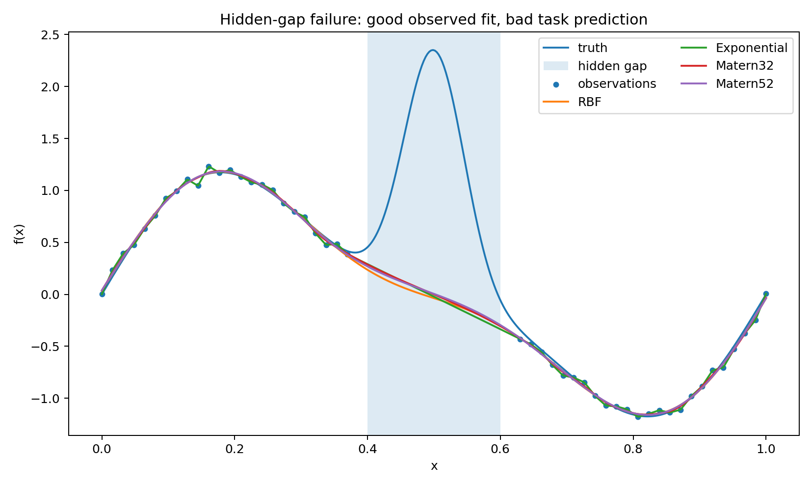

The posterior mean smoothly bridges the gap, as you would expect from a stationary kernel with nothing to contradict it. The unobserved interval just looks like terrain the kernel can interpolate across. What the GP cannot know — and has no reason to suspect — is that there is a localized event inside the gap.

The problem I want to isolate is not that the GP fails to infer an unobserved bump. Of course it cannot. The point is more basic: prediction over the gap is a different task from fitting the observed design, and the standard training-error diagnostic does not distinguish between them.

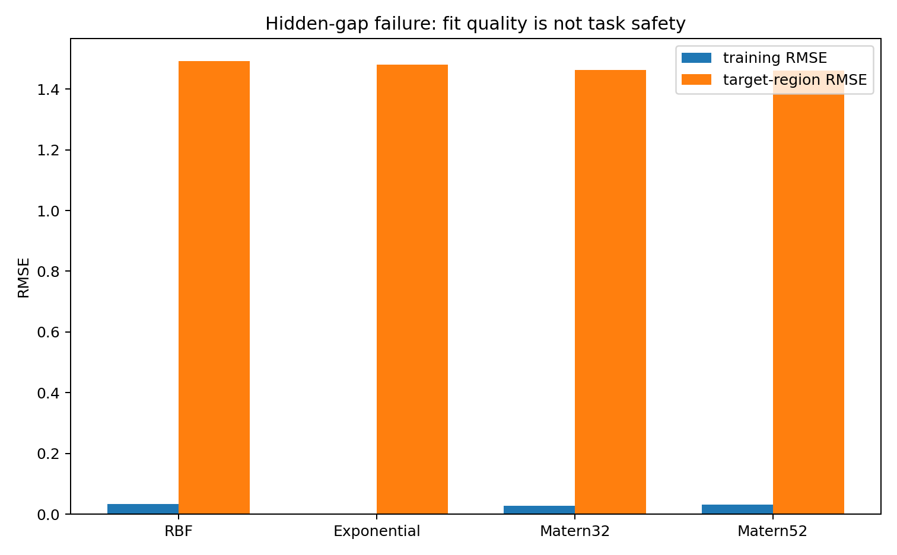

Training RMSE is small; target-region RMSE is large. The fit looks reassuring from outside while the actual failure is happening inside. The observed-data likelihood is doing its job — it is just answering a different question than the one we care about.

### Projection loss

$$
L_T
=
g_X^{-1/2}(g_{X,T}-g_X)g_X^{-1/2}.
$$

This asks how much Fisher geometry appears only once the target region is included. A large value means the map $\mathcal M_{X,T}\to \mathcal M_X$ is collapsing directions that the prediction depends on.

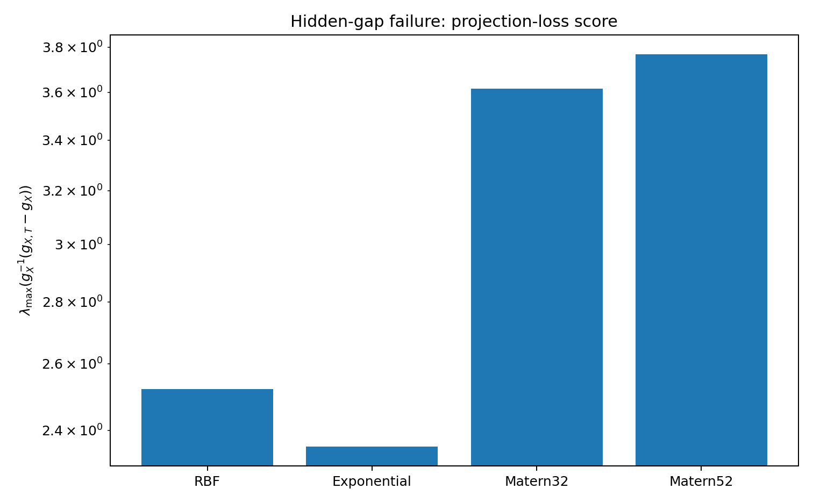

The score picks up the problem. The training design genuinely does not support inference over the gap, and the geometry reflects that without needing to know what the hidden truth is.

### Predictive sensitivity

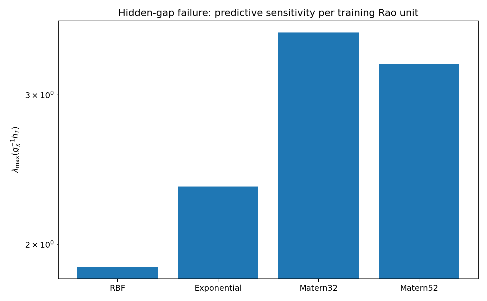

The predictive sensitivity is similarly elevated. A small move in hyperparameter space — small according to what the training data can distinguish — shifts the posterior over the gap substantially. The gap prediction is fragile in a way that the training fit is not.

### Coverage

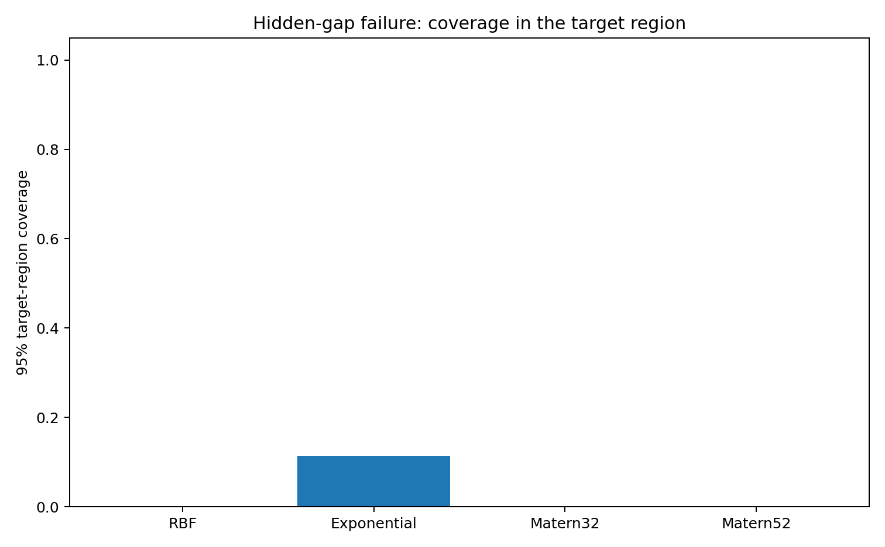

The nominal 95% bands miss the bump, which is not surprising once you look at the design. The more useful observation is that the geometry gives a way to flag this before looking at the hidden truth: the target region is poorly supported by the training manifold.

## Experiment 2: extrapolation

Here the training domain is $[0,1]$ and the prediction target is $[1,1.5]$. The true function changes regime outside the observed interval — something a stationary kernel has no direct evidence for.

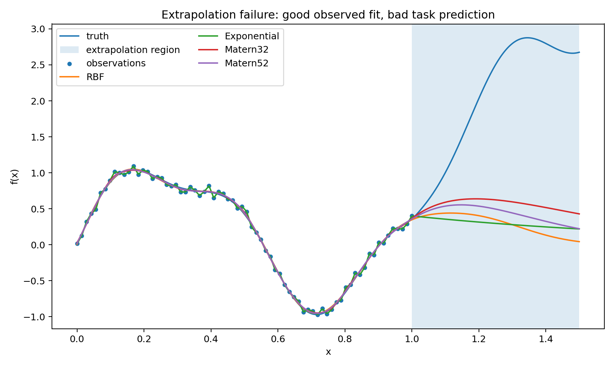

Outside the training domain the posterior either reverts toward the prior or continues according to the kernel's stationary correlation structure. Both behaviors are reasonable given what the model has seen. Neither is particularly reliable here, and it is worth being explicit about why.

Fitting the GP on $[0,1]$ constrains the covariance structure on $[0,1]$ reasonably well. It says much less about how that structure extends to $[1,1.5]$. The cross-covariance $k_\theta(T,X)$ is doing most of the extrapolation work, and the training data may not pin it down well enough for the actual function in that region. The kernel family imposes a form on the cross-covariance, but that form is an assumption, and the extrapolation result depends heavily on whether it holds.

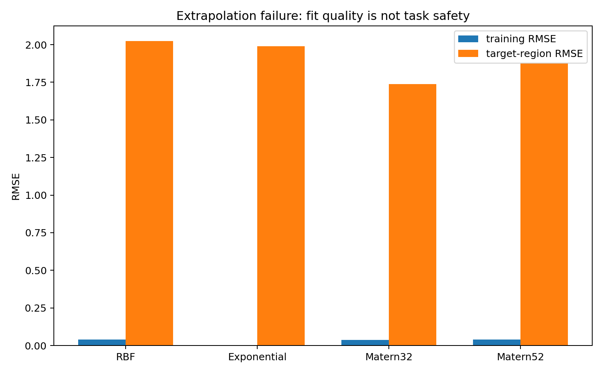

Same pattern: low training error, high target error. The training manifold $\mathcal M_X$ does not carry enough information about the extrapolation problem to make the prediction reliable.

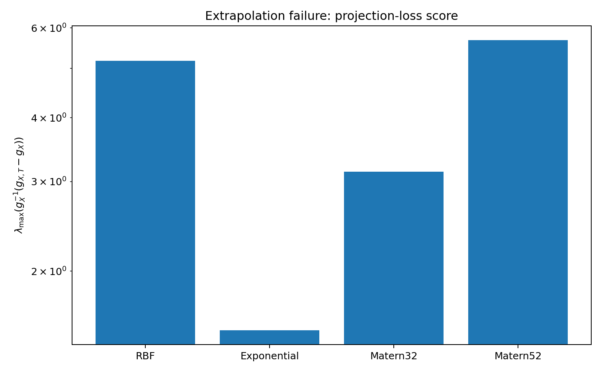

The projection-loss score is especially clear in this case. The augmented manifold $\mathcal M_{X,T}$ contains target-relevant directions that collapse when projected down to $\mathcal M_X$. So the observed-data likelihood looks good while the task remains under-supported.

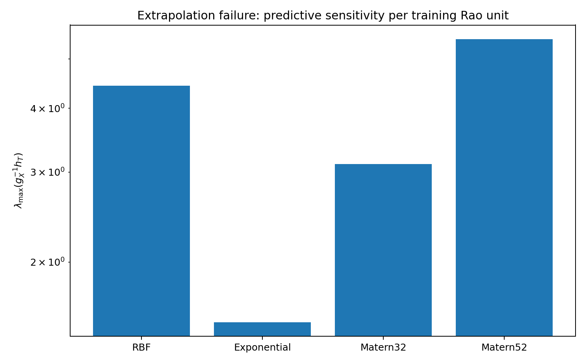

The target prediction outside $[0,1]$ is sensitive relative to the training Rao geometry — again, what we should expect when the cross-covariance is carrying so much weight and the training design cannot fully constrain it.

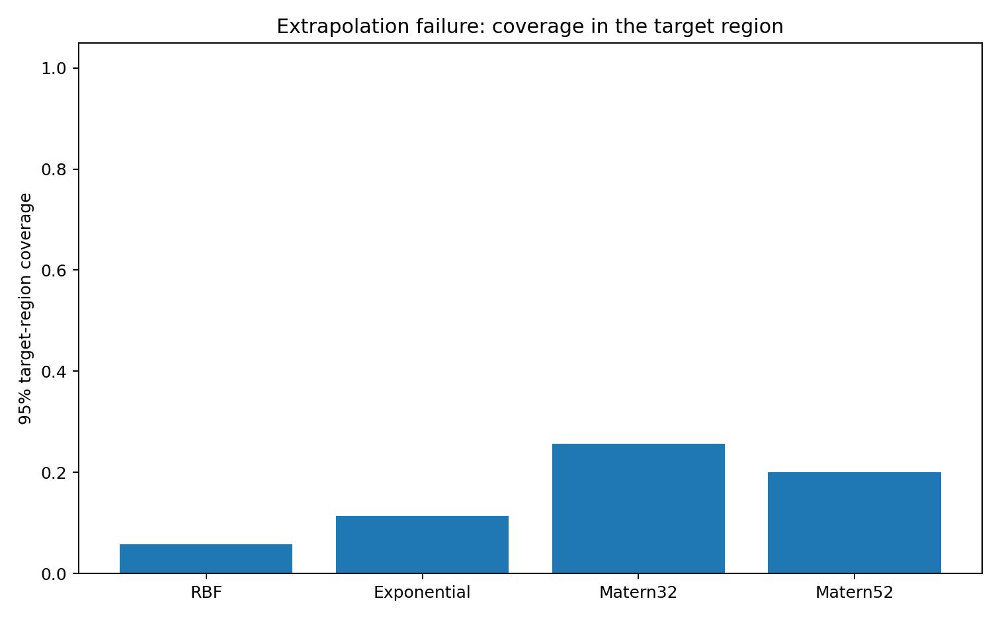

Coverage breaks down in the extrapolation region. The geometry says the same thing in advance, without the ground truth: $\mathcal M_X$ is not the full task manifold.

## Summary table

```{python}
#| label: tbl-summary
#| output: asis

print(summary_display.to_markdown(index=False))
```

## Geometry warning versus task failure

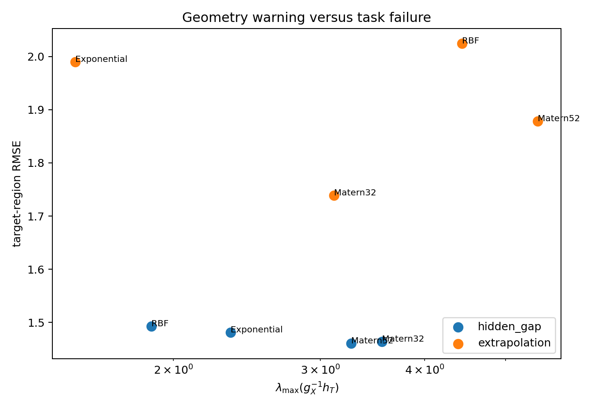

The vertical axis is actual target RMSE, computed using the hidden truth. The horizontal axis is the predictive-sensitivity score, which uses only the fitted model, the training design, and the target region — no ground truth required.

The cases where the geometric warning fires tend to be the cases where the target error is actually high. I would not treat this as a calibrated test, and it is certainly not a theorem. It is more like a flag: when the geometry looks bad, that is a signal to look harder at whether the training design really supports what you are trying to predict, rather than just trusting the training residuals.

## On what geometry can and cannot do

Information geometry cannot tell you what is hiding in an unobserved region. The GP in the first experiment has no way to infer the bump, and no diagnostic changes that.

The more limited claim — which I think is genuinely useful in practice — is that geometry can tell you when the prediction task is not well supported by the training manifold. The relevant object is not just $\mathcal M_X$ but the pair $(\mathcal M_X,\mathcal M_{X,T})$ together with the projection between them. When that projection is lossy, a good training fit is weak evidence for safe prediction. Knowing this does not solve the problem, but it at least means you are asking the right question.

## Practical diagnostic recipe

After fitting a GP at $\hat\theta$ and before reporting predictions over some target region $T$:

1. Compute the training Fisher metric $g_X(\hat\theta)$ and the augmented metric $g_{X,T}(\hat\theta)$.
2. Form $L_T=g_X^{-1/2}(g_{X,T}-g_X)g_X^{-1/2}$ and inspect the largest eigenvalues.
3. Compute the posterior-predictive metric $h_T(\hat\theta)$ and form $S_T^{\mathrm{rel}}=g_X^{-1/2}h_Tg_X^{-1/2}$.
4. Also worth checking: target information gain and the average kernel connection from $T$ to the training points.

If those diagnostics are large or unstable, a clean training fit should not be taken as evidence that the prediction over $T$ is reliable.

## References

Rao, C. R. (1945). *Information and the accuracy attainable in the estimation of statistical parameters*. Bulletin of the Calcutta Mathematical Society, 37, 81--91.

Efron, B. (1975). *Defining the curvature of a statistical problem, with applications to second order efficiency*. Annals of Statistics, 3(6), 1189--1242.

Amari, S. (2016). *Information Geometry and Its Applications*. Springer.

Rasmussen, C. E., and Williams, C. K. I. (2006). *Gaussian Processes for Machine Learning*. MIT Press.

## Suggested citation

```bibtex
@misc{miryusupov2026goodgpfitbadprediction,
  author       = {Miryusupov, Shohruh},
  title        = {Good GP Fit, Bad Prediction},
  year         = {2026},
  howpublished = {Research note},
  url          = {https://www.miryusupov.com/blog/posts/good_gp_fit_bad_prediction/}
}
```