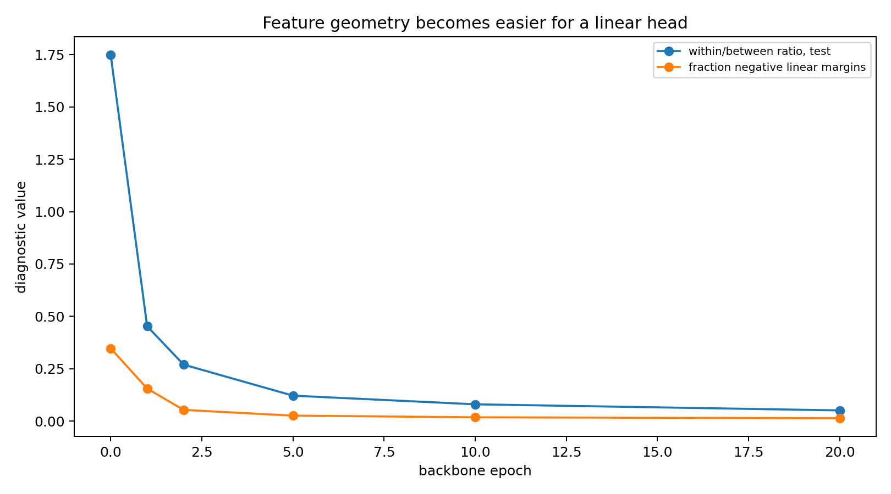
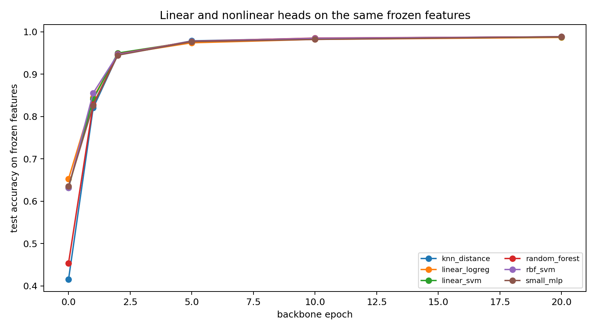
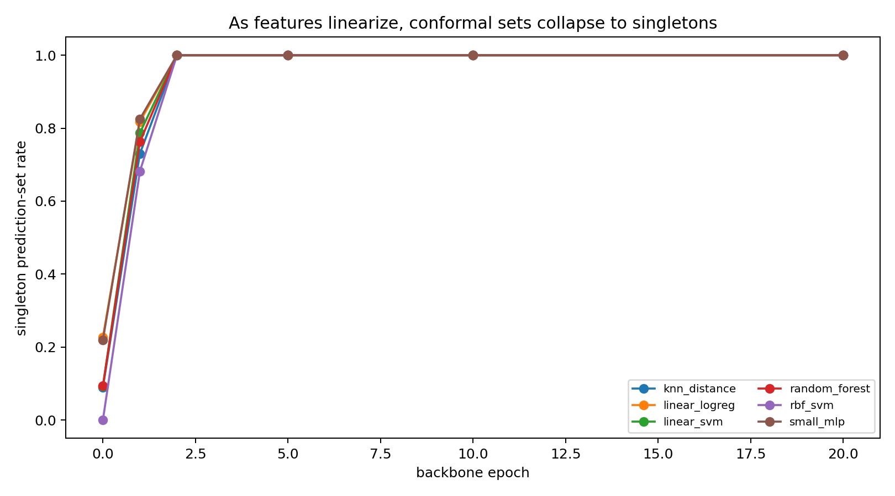
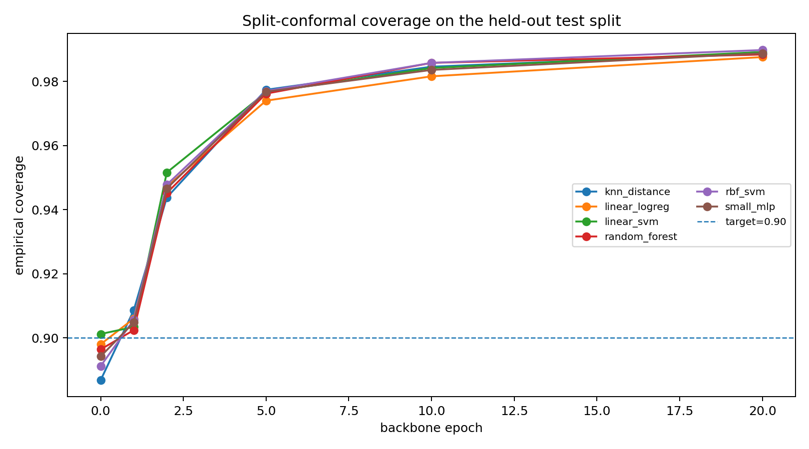

<style>
.narrow-figure {
  max-width: 760px;
  margin: 1.35rem auto 1.75rem auto;
}
.narrow-figure figure,
.narrow-figure .quarto-figure {
  max-width: 100%;
  margin-left: auto;
  margin-right: auto;
}
.narrow-figure img {
  width: 100%;
  height: auto;
  display: block;
  margin-left: auto;
  margin-right: auto;
  border-radius: 4px;
}
.narrow-figure figcaption {
  margin-top: 0.55rem;
  font-size: 0.92rem;
  line-height: 1.35;
  color: var(--bs-secondary-color, #666);
  text-align: left;
}
</style>

A common recipe in representation learning is to take a frozen backbone $\phi$, extract features $z = \phi(x) \in \mathbb{R}^d$, and then swap in a more expressive head — a random forest, an RBF-kernel SVM, a Gaussian process, a $k$-nearest-neighbor rule, a small MLP. The usual headline is that the nonlinear head improves accuracy over logistic regression.

But that comparison is often the wrong one. Once the backbone has made the labels almost linearly readable, a nonlinear head is working in the residual geometry — boundary cases, ambiguous examples, small regularization differences. Whether it actually beats the *best* linear head, not just logistic regression, is a different and stricter question.

This note runs that stricter comparison on a small MNIST/ViT experiment. At the final checkpoint, nonlinear heads do beat logistic regression. They don't stably beat the best linear head. That gap is the point.

## The fixed-representation question

Once $\phi$ is frozen, we're no longer asking whether the original input $X$ is easy. We're asking whether the labels are simple functions of $Z = \phi(X)$.

Define the best linear error and the best-over-a-richer-class error:

$$R^*_{\mathrm{lin}}(\phi) = \inf_{h \in \mathcal{H}_{\mathrm{lin}}} \mathbb{P}\{h(\phi(X)) \ne Y\}, \qquad R^*_{\mathrm{rich}}(\phi) = \inf_{h \in \mathcal{H}_{\mathrm{rich}}} \mathbb{P}\{h(\phi(X)) \ne Y\}.$$

The quantity a richer head class can exploit is $G(\phi) = R^*_{\mathrm{lin}}(\phi) - R^*_{\mathrm{rich}}(\phi)$. If $G(\phi)$ is large, the representation still contains useful nonlinear label geometry. If it's small, the backbone has already made the task essentially linearly readable.

Empirically, we don't observe $G(\phi)$ directly. We fit several heads on the same frozen features and compare them on the same held-out examples. For a nonlinear head $h$ and linear baseline $g$, the paired accuracy difference is

$$\widehat{\Delta}(h,g) = \frac{1}{n} \sum_{i=1}^n \left[\mathbf{1}\{h(z_i) = y_i\} - \mathbf{1}\{g(z_i) = y_i\}\right].$$

The pairing matters — two classifiers evaluated on the same examples aren't independent. A nonlinear head is meaningfully better only if it wins more disagreements than it loses, not merely if its point estimate is slightly higher. I use bootstrap confidence intervals for paired differences and McNemar counts

$$n_{01} = \#\{g \text{ wrong},\; h \text{ correct}\}, \qquad n_{10} = \#\{g \text{ correct},\; h \text{ wrong}\}.$$

## The experiment

I trained a compact ViT-style backbone on MNIST and saved checkpoints during training. At each checkpoint $t$, I froze the representation $z = \phi_t(x)$, extracted features, and trained heads on top. The heads were logistic regression, linear SVM, distance-weighted $k$-nearest neighbors, random forest, RBF-SVM, and a small MLP.

The key comparison throughout is not nonlinear heads versus logistic regression. Logistic regression is just one linear probe. The stricter comparison is nonlinear heads versus the best linear head at the same checkpoint.

```{python}
#| include: false

from pathlib import Path
import math
import pandas as pd
import matplotlib.pyplot as plt

POST_DIR = Path(".")
FIG_DIR = POST_DIR / "figures"
DATA_DIR = POST_DIR / "data"

has_tables = (DATA_DIR / "head_results.csv").exists()
```

## What the backbone is actually doing

The geometric diagnostics show the backbone doing the hard work, not the head.

A crude but useful diagnostic is the within/between ratio

$$\rho = \frac{\frac{1}{n}\sum_{i=1}^n \|z_i - \mu_{y_i}\|^2}{\frac{1}{K}\sum_{k=1}^K \|\mu_k - \mu\|^2}.$$

Low $\rho$ means classes are compact relative to their separation — a good sign for linear separability, though not a proof of it. I also tracked the multiclass margin of a fitted linear head,

$$m_i = s_{y_i}(z_i) - \max_{k \ne y_i} s_k(z_i),$$

where $s_k(z) = w_k^\top z + b_k$. Negative margin means the linear classifier gets that point wrong.

From epoch 1 to epoch 20:

$$\rho_{\mathrm{test}}: 0.4526 \longrightarrow 0.0510,$$

and the fraction of negative linear margins drops from $0.1553 \to 0.0135$. The median linear margin grows from about $3.08 \to 9.36$.

So the story isn't just that accuracy goes up. The representation is being reshaped into a geometry where a linear rule has large positive margin on almost all points.

::: {.narrow-figure}

:::

## PCA is a shadow, not the proof

A two-dimensional PCA projection isn't a certificate of separability. High-dimensional classes can be linearly separated even when a two-dimensional projection overlaps, and a clean-looking projection can be misleading in the other direction too. The margins above are the measurement; PCA is only a sanity check that the representation is organizing itself visually.

```{python}
#| label: fig-pca-points
#| fig-cap: "PCA projections of frozen test features across checkpoints. This is only a two-dimensional shadow of the representation geometry."

pca_path = DATA_DIR / "pca_points.csv"
if pca_path.exists():
    pca = pd.read_csv(pca_path)
    epochs = sorted(pca["epoch"].unique())
    keep = [e for e in [0, 1, 2, 5, 10, 20] if e in epochs]
    if not keep:
        keep = epochs[:6]

    ncols = 3
    nrows = math.ceil(len(keep) / ncols)
    fig, axes = plt.subplots(
        nrows,
        ncols,
        figsize=(4.2 * ncols, 3.6 * nrows),
        squeeze=False,
    )

    for ax, epoch in zip(axes.ravel(), keep):
        df = pca[pca["epoch"] == epoch]
        ax.scatter(
            df["pc1"],
            df["pc2"],
            c=df["y"],
            s=8,
            alpha=0.65,
            cmap="tab10",
            linewidths=0,
        )
        ax.set_title(f"epoch {epoch}")
        ax.set_xlabel("PC1")
        ax.set_ylabel("PC2")

    for ax in axes.ravel()[len(keep):]:
        ax.axis("off")

    fig.tight_layout()
    plt.show()
else:
    print(f"No PCA file found at {pca_path}. Copy data/pca_points.csv into the post folder.")
```

## The leaderboard at the final checkpoint

At the final checkpoint, nonlinear heads do improve over logistic regression:

$$\text{logistic regression} = 0.9865, \qquad \text{best nonlinear heads} \approx 0.9881.$$

That's a gain of about 0.0016, or 16 examples per 10,000. Against logistic regression, some paired tests are significant.

But the best linear head at the same checkpoint — a linear SVM — scores 0.9875. Against that baseline, the nonlinear heads improve by only 0.0005 to 0.0006, with bootstrap confidence intervals crossing zero and McNemar $p$-values around 0.38 to 0.54.

A nonlinear head can beat a weak linear probe while failing to beat the best regularized linear probe in a statistically stable way. If the claim is that the backbone left important nonlinear structure in the features, the right baseline isn't just logistic regression — it's the best simple linear decision rule you can fit.

::: {.narrow-figure}

:::

::: {.narrow-figure}

:::

::: {.narrow-figure}

:::

::: {.narrow-figure}

:::

## Why the late gain is so small

Once the representation is nearly linearly separable, most examples are easy for all reasonable heads. The remaining disagreements are concentrated near the boundary or among genuinely ambiguous digits.

A nonlinear head can still relabel some of those points. But the size of the possible gain is now controlled by the small remaining error of the best linear head. Here, that error is about $1 - 0.9875 = 0.0125$. The nonlinear gain over it is about 0.0006, which is roughly 4.8% of the remaining linear error. Not nothing — but not a qualitative change in the geometry either.

## Conformal prediction as an uncertainty diagnostic

Accuracy asks which head wins point prediction. Conformal prediction asks something slightly different: at fixed coverage, does the nonlinear head produce smaller prediction sets?

For classification, a split-conformal predictor returns a set $C(x) \subseteq \{1,\ldots,K\}$ satisfying $\mathbb{P}\{Y \in C(X)\} \ge 1 - \alpha$. I used a rank nonconformity score: for scores $S_k(x)$, define

$$r_y(x) = 1 + \#\{k : S_k(x) > S_y(x)\}.$$

The true top class has rank 1, the second class rank 2, and so on. On calibration data, compute the conformal quantile $\hat{q}$, then $C(x) = \{y : r_y(x) \le \hat{q}\}$.

At the final checkpoint, at 90% coverage, every head gives average set size 1.0 and singleton rate 1.0, with coverage around 0.988. This isn't a calibration result — it means the top-ranked class is already sufficient for the desired marginal coverage, so conformal sets collapse to singletons.

::: {.narrow-figure}

:::

::: {.narrow-figure}

:::

::: {.narrow-figure}

:::

The early checkpoints are more informative. Around epoch 0, average set size is about 2.69 and singleton rate about 0.23. By epoch 1, average set size is already 1.19 and singleton rate 0.82. From epoch 2 onward, singleton sets are enough.

The conformal story mirrors the separability story: as the backbone linearizes the task, conformal sets collapse from multi-label uncertainty to singleton predictions. The nonlinear head may still win a few point predictions, but it doesn't buy meaningfully smaller uncertainty sets once the representation is already linearly readable.

## What this doesn't show

A few honest caveats. MNIST is easy — a harder dataset like CIFAR-10 should leave a longer middle regime where nonlinear heads and conformal set sizes differ more visibly. Finite-sample separability isn't the same as useful separability either; in high dimension, many training sets can be separated, and what matters is whether a regularized linear classifier generalizes with margin. And rank conformal is coarse: once top-1 accuracy exceeds the coverage target, it returns singleton sets regardless, so for a finer uncertainty comparison you'd want higher coverage targets (e.g. 99%) or probability-based scores like LAC, APS, or RAPS.

For this note, the coarseness is actually useful — when singleton sets already overcover, uncertainty is no longer where the nonlinear head is helping.

## Takeaway

The nonlinear head isn't magic added after the backbone. It's a test of what geometry the backbone left behind.

If nonlinear heads help a lot, the representation hasn't made the task linearly readable. If they help only by a few borderline examples, and conformal sets are already singleton at the desired coverage, the backbone has done the main work. In this experiment, the late-checkpoint representation is not merely accurate — it's linearly readable with large margin, and the bottleneck is there, not in the head.

---

## Reproducibility notes

The run used saved checkpoints and post-hoc frozen-feature evaluation. The post directory is organized as:

```
blog/posts/linear_readability_bottleneck/
  index.qmd
  figures/
    geometry_diagnostics.png
    head_accuracy_by_epoch.png
    nonlinear_gain_by_epoch.png
    gain_vs_linear_accuracy.png
    best_gain_vs_linear_error.png
    conformal_avg_set_size_by_epoch.png
    conformal_singleton_rate_by_epoch.png
    conformal_coverage_by_epoch.png
  data/
    head_results.csv
    readability_metrics.csv
    conformal_results.csv
    conformal_examples.csv
    pca_points.csv
  config.json
  summary.md
```

The PCA panel is generated from `data/pca_points.csv`. Other figures are loaded from the saved `figures/` directory. CSV files are included as resources so the post remains reproducible without rerunning the training script.

---

## References

Guillaume Alain and Yoshua Bengio. "Understanding Intermediate Layers Using Linear Classifier Probes." arXiv:1610.01644, 2016.

Simon Kornblith, Jonathon Shlens, and Quoc V. Le. "Do Better ImageNet Models Transfer Better?" *CVPR*, 2019.

Vladimir Vovk, Alexander Gammerman, and Glenn Shafer. *Algorithmic Learning in a Random World*. Springer, 2005.

Anastasios N. Angelopoulos and Stephen Bates. "A Gentle Introduction to Conformal Prediction and Distribution-Free Uncertainty Quantification." arXiv:2107.07511, 2021.

Quinn McNemar. "Note on the Sampling Error of the Difference Between Correlated Proportions or Percentages." *Psychometrika* 12, 1947.

Bradley Efron and Robert Tibshirani. *An Introduction to the Bootstrap*. Chapman & Hall, 1993.

## Suggested citation

```bibtex
@misc{miryusupov2026linearreadability,
  author       = {Miryusupov, Shohruh},
  title        = {When Linear Readability Is the Bottleneck},
  year         = {2026},
  howpublished = {Research note},
  url          = {https://www.miryusupov.com/blog/posts/linear_readability_bottleneck/}
}
```