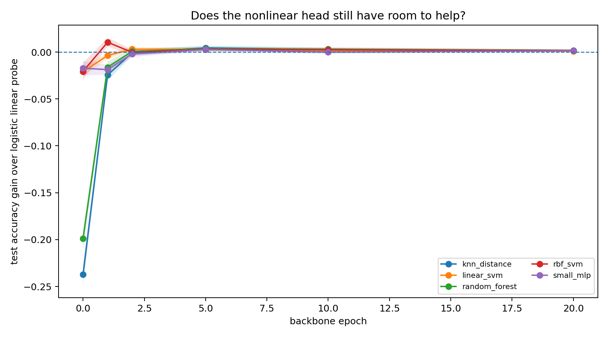
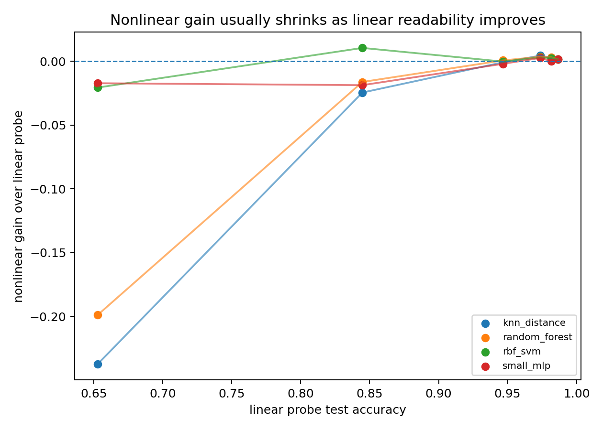
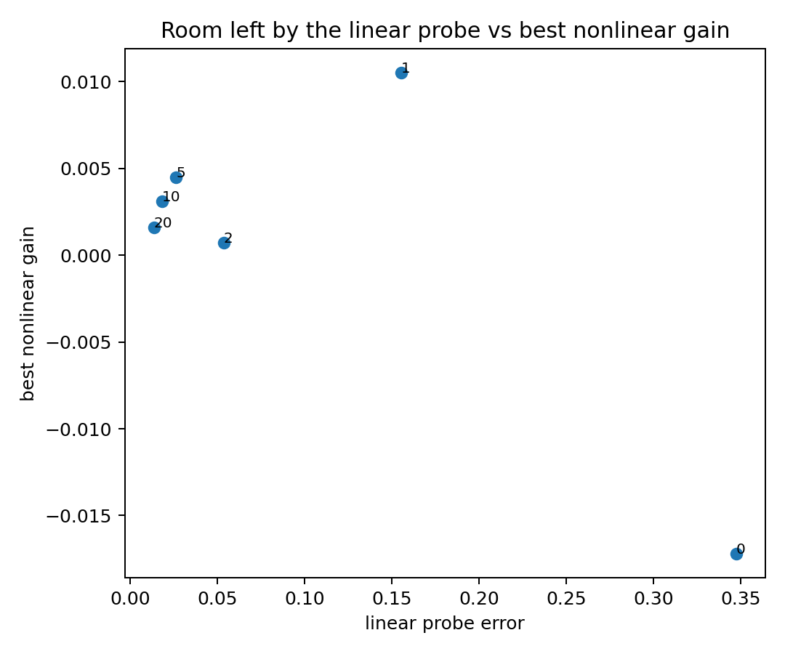
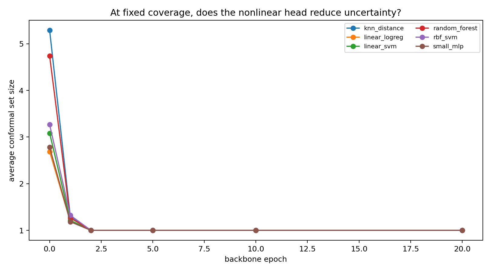

<style>
.narrow-figure {
  max-width: 760px;
  margin: 1.35rem auto 1.75rem auto;
}
.narrow-figure figure,
.narrow-figure .quarto-figure {
  max-width: 100%;
  margin-left: auto;
  margin-right: auto;
}
.narrow-figure img {
  width: 100%;
  height: auto;
  display: block;
  margin-left: auto;
  margin-right: auto;
  border-radius: 4px;
}
.narrow-figure figcaption {
  margin-top: 0.55rem;
  font-size: 0.92rem;
  line-height: 1.35;
  color: var(--bs-secondary-color, #666);
  text-align: left;
}
</style>

**Claim.** Once a frozen representation makes labels linearly readable, nonlinear heads have little geometry left to exploit.

**Scope.** A small MNIST/ViT diagnostic comparing nonlinear heads against the best linear head, not just logistic regression.

## Preface

A common recipe in representation learning is

$$
x \longmapsto z=\phi(x)\in\mathbb R^d
\longmapsto \text{head}(z),
$$

where $\phi$ is a frozen backbone and the head is replaced by something more expressive: a random forest, an RBF-kernel SVM, a Gaussian process, a $k$-nearest-neighbor rule, or a small MLP. The usual headline is then:

> adding a nonlinear head improves accuracy.

That sentence is not false, but it hides the more important geometric question:

> Did the backbone already make the labels linearly readable?

If the answer is yes, then the nonlinear head has little left to do. It may still win a leaderboard by a few examples. It may regularize differently. It may change the tie-breaking on borderline points. But it is no longer solving the main representation problem. The backbone has already done that.

The point of this note is not that nonlinear heads are useless. The point is narrower:

> nonlinear heads diagnose what geometry the frozen representation left behind.

In the final checkpoint below, nonlinear heads do beat logistic regression. But they do not stably beat the best linear head. That difference is the point of the note.

If a nonlinear head gives a large and stable gain over the best linear head, the representation still contains useful nonlinear label geometry. If the gain is small, unstable, and concentrated near the remaining boundary errors, then the main bottleneck is no longer the head. It is the linear readability of the representation.

## The fixed-representation question

Let

$$
Z=\phi(X)\in\mathbb R^d,
$$

where $\phi$ is a representation learned by a backbone. Once $\phi$ is frozen, the learning problem changes. We are no longer asking whether the original input $X$ is easy. We are asking whether the labels are simple functions of $Z$.

The linear family is

$$
\mathcal H_{\mathrm{lin}}
=
\left\{
  z\mapsto \arg\max_k\; w_k^\top z+b_k
\right\}.
$$

A richer comparison class can include nonlinear heads:

$$
\mathcal H_{\mathrm{rich}}
=
\mathcal H_{\mathrm{lin}}
\cup
\{\text{RBF-SVM},\;\text{random forest},\;k\text{NN},\;\text{small MLP},\ldots\}.
$$

For a fixed representation $\phi$, define

$$
R^*_{\mathrm{lin}}(\phi)
=
\inf_{h\in\mathcal H_{\mathrm{lin}}}
\mathbb P\{h(\phi(X))\ne Y\},
$$

and

$$
R^*_{\mathrm{rich}}(\phi)
=
\inf_{h\in\mathcal H_{\mathrm{rich}}}
\mathbb P\{h(\phi(X))\ne Y\}.
$$

The quantity a richer head class can exploit is

$$
G(\phi)
=
R^*_{\mathrm{lin}}(\phi)-R^*_{\mathrm{rich}}(\phi).
$$

If $G(\phi)$ is large, the representation still contains useful nonlinear label geometry. If $G(\phi)$ is small, then the representation has already made the task essentially linearly readable.

Empirically, we do not observe $G(\phi)$ directly. We fit several heads on the same frozen features and compare them on the same held-out examples. For a nonlinear head $h$ and a linear baseline $g$, define the paired accuracy difference

$$
\widehat\Delta(h,g)
=
\frac1n\sum_{i=1}^n
\left[
\mathbf 1\{h(z_i)=y_i\}
-
\mathbf 1\{g(z_i)=y_i\}
\right].
$$

The pairing matters. Two classifiers evaluated on the same examples are not independent. A nonlinear head is meaningfully better only if it wins more disagreements than it loses, not merely if its point estimate is slightly higher. I therefore look at bootstrap confidence intervals for paired differences and at McNemar counts

$$
n_{01}=\#\{g\text{ wrong},\;h\text{ correct}\},
\qquad
n_{10}=\#\{g\text{ correct},\;h\text{ wrong}\}.
$$

## A linearization experiment

The experiment is deliberately small. I trained a compact ViT-style backbone on MNIST and saved checkpoints during training. At each checkpoint $t$, I froze the representation

$$
z=\phi_t(x),
$$

extracted features, and trained heads on top of those features only.

The heads were logistic regression, linear SVM, distance-weighted $k$-nearest neighbors, random forest, RBF-SVM, and a small MLP.

The key comparison is not only nonlinear heads versus logistic regression. Logistic regression is just one linear probe. The stricter comparison is nonlinear heads versus the **best linear head** at the same checkpoint.

```{python}
#| include: false

from pathlib import Path
import math
import pandas as pd
import matplotlib.pyplot as plt

POST_DIR = Path(".")
FIG_DIR = POST_DIR / "figures"
DATA_DIR = POST_DIR / "data"

has_tables = (DATA_DIR / "head_results.csv").exists()
```

## What changes during training?

The geometric diagnostics show the backbone doing the hard work.

Let $\mu_k$ be the class mean in feature space and $\mu$ the global mean. A crude but useful diagnostic is the within/between ratio

$$
\rho
=
\frac{
\frac1n\sum_{i=1}^n\|z_i-\mu_{y_i}\|^2
}{
\frac1K\sum_{k=1}^K\|\mu_k-\mu\|^2
}.
$$

Low $\rho$ means that classes are compact relative to their separation. This is not a proof of linear separability, but it is a good diagnostic for whether the representation is forming separated class clouds.

I also fit a linear head and measure its multiclass margin

$$
m_i
=
s_{y_i}(z_i)-\max_{k\ne y_i}s_k(z_i),
$$

where $s_k(z)=w_k^\top z+b_k$. Negative margin means the linear classifier gets the point wrong.

In the run here, from epoch 1 to epoch 20,

$$
\rho_{\mathrm{test}}: 0.4526\longrightarrow 0.0510,
$$

while the fraction of negative linear margins drops from

$$
0.1553\longrightarrow 0.0135.
$$

The median linear margin grows from about

$$
3.08\longrightarrow 9.36.
$$

So the story is not merely that accuracy goes up. The representation itself is being reshaped into a geometry where a linear rule has a large positive margin on almost all points.

::: {.narrow-figure}

:::

## PCA is a shadow, not the proof

A two-dimensional PCA projection is not a certificate of separability. High-dimensional classes can be linearly separated even when a two-dimensional projection overlaps, and a clean projection can also be misleading.

Still, PCA is useful as a visual sanity check. If the backbone is really linearizing the task, the PCA shadow should show class clouds becoming more organized over checkpoints. The margins above are the measurement; PCA is only the picture.

```{python}
#| label: fig-pca-points
#| fig-cap: "PCA projections of frozen test features across checkpoints. This is only a two-dimensional shadow of the representation geometry."

pca_path = DATA_DIR / "pca_points.csv"
if pca_path.exists():
    pca = pd.read_csv(pca_path)
    epochs = sorted(pca["epoch"].unique())
    keep = [e for e in [0, 1, 2, 5, 10, 20] if e in epochs]
    if not keep:
        keep = epochs[:6]

    ncols = 3
    nrows = math.ceil(len(keep) / ncols)
    fig, axes = plt.subplots(
        nrows,
        ncols,
        figsize=(4.2 * ncols, 3.6 * nrows),
        squeeze=False,
    )

    for ax, epoch in zip(axes.ravel(), keep):
        df = pca[pca["epoch"] == epoch]
        ax.scatter(
            df["pc1"],
            df["pc2"],
            c=df["y"],
            s=8,
            alpha=0.65,
            cmap="tab10",
            linewidths=0,
        )
        ax.set_title(f"epoch {epoch}")
        ax.set_xlabel("PC1")
        ax.set_ylabel("PC2")

    for ax in axes.ravel()[len(keep):]:
        ax.axis("off")

    fig.tight_layout()
    plt.show()
else:
    print(f"No PCA file found at {pca_path}. Copy data/pca_points.csv into the post folder.")
```

## The leaderboard gain

At the final checkpoint, nonlinear heads do improve over plain logistic regression:

$$
\text{logistic regression}=0.9865,
\qquad
\text{best nonlinear heads}\approx 0.9881.
$$

That is a gain of about

$$
0.0016,
$$

or 16 examples per 10,000. Against logistic regression, some paired tests are significant.

But this is the weaker comparison. The best linear head at the same checkpoint was a linear SVM:

$$
\text{linear SVM}=0.9875.
$$

Against this stronger linear baseline, the nonlinear heads improve by only

$$
0.0005\text{ to }0.0006,
$$

with bootstrap confidence intervals crossing zero and McNemar $p$-values around $0.38$ to $0.54$.

So the main conclusion is not that nonlinear heads never help. The conclusion is sharper:

> A nonlinear head can beat a weak linear probe while failing to beat the best regularized linear probe in a statistically stable way.

That distinction matters. If the claim is that the backbone has left important nonlinear structure in the features, the right baseline is not just logistic regression. It is the best simple linear decision rule we can reasonably fit.

::: {.narrow-figure}

:::

::: {.narrow-figure}

:::

::: {.narrow-figure}

:::

::: {.narrow-figure}

:::

## Why the late gain is small

Once the representation is nearly linearly separable, most examples are easy for all reasonable heads. The remaining disagreements are concentrated near the boundary or among ambiguous examples.

A nonlinear head can still change the labels of some of those points. But the size of the possible gain is now controlled by the small remaining error of the best linear head.

In this run, the best linear head has error about

$$
1-0.9875=0.0125.
$$

The nonlinear gain over it is about

$$
0.0006,
$$

which is roughly

$$
\frac{0.0006}{0.0125}\approx 4.8\%
$$

of the remaining linear error.

That is not nothing. But it is not a qualitative change in the geometry. It is a small improvement inside a regime where the backbone has already made the task mostly linear.

## Conformal prediction as an uncertainty diagnostic

Accuracy asks which head wins point prediction. Conformal prediction asks a slightly different question:

> At fixed coverage, does the nonlinear head produce smaller prediction sets?

At 90% coverage, this diagnostic is intentionally coarse. Since the final top-1 accuracies are already far above 90%, rank conformal has little room to distinguish the heads. That triviality is itself informative: at this coverage level, uncertainty has already collapsed to singleton predictions.

For classification, a split-conformal predictor returns a set

$$
C(x)\subseteq\{1,\ldots,K\}
$$

rather than a single label. Ideally,

$$
\mathbb P\{Y\in C(X)\}\ge 1-\alpha.
$$

The experiment uses a separate selection, calibration, and evaluation protocol, so the head is not selected on the same examples used for the final conformal report.

For the main run I used a rank score. Let $S_k(x)$ be the score assigned to class $k$. Define the rank nonconformity score

$$
r_y(x)
=
1+\#\{k:S_k(x)>S_y(x)\}.
$$

The true top class has rank $1$, the second class has rank $2$, and so on. On calibration data, compute the conformal quantile $\widehat q$. On a new point,

$$
C(x)=\{y:r_y(x)\le \widehat q\}.
$$

With this rank score, singleton conformal sets occur when $\widehat q=1$, meaning the top-ranked label is already sufficient for the desired marginal coverage.

At the final checkpoint, the answer is yes for every head. With a 90% target, all heads have

$$
\text{average set size}=1.0,
\qquad
\text{singleton rate}=1.0,
$$

and coverage around $0.988$ on the conformal evaluation split.

This is not evidence that the heads are perfectly calibrated. It says something simpler and more geometric: by the final checkpoint, top-1 prediction is already conservative relative to a 90% coverage target. Conformal uncertainty has collapsed to singleton sets.

::: {.narrow-figure}

:::

::: {.narrow-figure}

:::

::: {.narrow-figure}

:::

The early checkpoints are more informative. Around epoch 0, the selected conformal predictor has average set size about $2.69$ and singleton rate about $0.23$. Around epoch 1, average set size is already about $1.19$ and singleton rate about $0.82$. From epoch 2 onward, singleton sets are enough.

So the conformal story mirrors the separability story:

> As the backbone linearizes the task, conformal sets collapse from multi-label uncertainty to singleton predictions.

The nonlinear head may still win a few point predictions, but it does not buy a qualitatively smaller uncertainty set once the representation is already linearly readable.

## What the experiment does not show

This is a diagnostic, not a universal theorem.

First, MNIST is easy. A harder dataset such as CIFAR-10 should leave a longer middle regime where nonlinear heads and conformal set sizes differ more visibly.

Second, finite-sample separability is not the same as useful separability. In high dimension, many training sets can be separated. The relevant question is whether a regularized linear classifier generalizes with margin.

Third, rank conformal is coarse. Once top-1 accuracy exceeds the coverage target, rank conformal returns singleton sets. For a finer uncertainty comparison, one should also try higher coverage targets such as $99\%$, or probability-based scores such as LAC, APS, or RAPS.

But for this note, the coarse diagnostic is useful precisely because it becomes trivial: when top-1 singleton sets already overcover, uncertainty is no longer where the nonlinear head is helping.

## Takeaway

The nonlinear head is not magic added after the backbone. It is a test of what geometry the backbone left behind.

If nonlinear heads help a lot, the representation has not made the task linearly readable. If nonlinear heads help only by a few borderline examples, and if conformal sets are already singleton at the desired coverage, then the backbone has already done the main work.

In this experiment, the late-checkpoint representation is not merely accurate. It is linearly readable with large margin. Nonlinear heads can slightly reshuffle the boundary, but they do not change the basic picture:

$$
\boxed{
\text{the bottleneck is linear readability of the representation.}
}
$$

## Reproducibility notes

The run used saved checkpoints and posthoc frozen-feature evaluation. For the blog version, the post directory is organized as

```text
blog/posts/linear_separability_bottleneck/
  index.qmd
  figures/
    geometry_diagnostics.png
    head_accuracy_by_epoch.png
    nonlinear_gain_by_epoch.png
    gain_vs_linear_accuracy.png
    best_gain_vs_linear_error.png
    conformal_avg_set_size_by_epoch.png
    conformal_singleton_rate_by_epoch.png
    conformal_coverage_by_epoch.png
  data/
    head_results.csv
    separability_metrics.csv
    conformal_results.csv
    conformal_examples.csv
    pca_points.csv
  config.json
  summary.md
```

The PCA panel is generated from `data/pca_points.csv`. The other figures are loaded from the saved `figures/` directory. The CSV files are included as resources so that the post remains reproducible without rerunning the training script.

## References

Guillaume Alain and Yoshua Bengio. “Understanding Intermediate Layers Using Linear Classifier Probes.” arXiv:1610.01644, 2016.

Simon Kornblith, Jonathon Shlens, and Quoc V. Le. “Do Better ImageNet Models Transfer Better?” *Proceedings of the IEEE/CVF Conference on Computer Vision and Pattern Recognition*, 2019.

Vladimir Vovk, Alexander Gammerman, and Glenn Shafer. *Algorithmic Learning in a Random World*. Springer, 2005.

Anastasios N. Angelopoulos and Stephen Bates. “A Gentle Introduction to Conformal Prediction and Distribution-Free Uncertainty Quantification.” arXiv:2107.07511, 2021.

Quinn McNemar. “Note on the Sampling Error of the Difference Between Correlated Proportions or Percentages.” *Psychometrika* 12, 1947.

Bradley Efron and Robert Tibshirani. *An Introduction to the Bootstrap*. Chapman & Hall, 1993.

## Suggested citation

```bibtex
@misc{miryusupov2026linearseparability,
  author       = {Miryusupov, Shohruh},
  title        = {Linear Separability Is the Bottleneck},
  year         = {2026},
  howpublished = {Research note},
  url          = {https://www.miryusupov.com/blog/posts/linear_separability_bottleneck/}
}
```