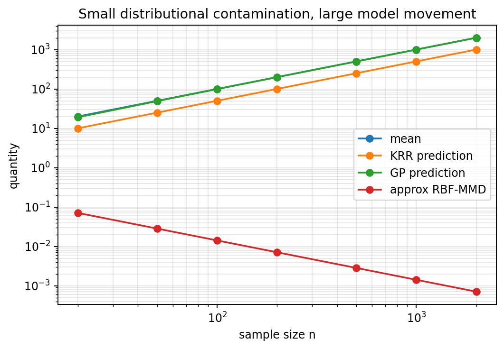

<style>
.article-figure {
  max-width: 760px;
  margin: 1.35rem auto 1.75rem auto;
}
.article-figure img {
  width: 100%;
  height: auto;
  display: block;
  margin-left: auto;
  margin-right: auto;
  border-radius: 4px;
}
.article-figure figcaption {
  margin-top: 0.55rem;
  font-size: 0.92rem;
  line-height: 1.35;
  color: var(--bs-secondary-color, #666);
  text-align: left;
}
</style>


**Claim.** A learning rule that is discontinuous under small Prokhorov perturbations can amplify vanishing contamination into arbitrarily large model movement.  
**Scope.** Prokhorov continuity as a robustness sanity check; counterexamples for tail-sensitive and argmin-sensitive learning methods.

## Preface

Many machine-learning failures are not caused by obvious outliers. A corrupted point may not be far away in Euclidean distance. A mislabeled example may look perfectly typical. A rare sensor glitch may be indistinguishable from a legitimate observation.

This suggests a robustness question that is more distributional than geometric:

$$
P \approx Q
\quad \text{but do we also have} \quad
A(P) \approx A(Q)?
$$

Here $P$ is the clean data-generating distribution, $Q$ is the corrupted distribution, and $A(P)$ is the model, estimator, predictor, clustering, or representation learned from $P$.

The point of this note is narrow:

> A learning rule should not amplify a vanishing amount of hidden distributional contamination into an arbitrarily large model movement.

This is not a claim that Prokhorov distance is always the right metric. It is a claim about alignment between the uncertainty model and the learning rule. If the practical uncertainty is small-mass contamination, then a robust learner should be stable under small-mass contamination.

## Part I: Prokhorov continuity

Let $\mathcal Z$ be the data space, for example $\mathcal Z=\mathcal X\times\mathcal Y$. Let $\mathcal P(\mathcal Z)$ denote probability measures on $\mathcal Z$. A learning method can be viewed abstractly as a map

$$
A:\mathcal P(\mathcal Z)\to\mathcal H,
$$

where $\mathcal H$ may be a parameter space, an RKHS, a set of classifiers, a set of cluster centers, or a space of predictive distributions.

We say that $A$ is Prokhorov-continuous at $P$ if

$$
\rho_{\mathrm{Pr}}(Q_n,P)\to0
\quad\Rightarrow\quad
 d_{\mathcal H}\{A(Q_n),A(P)\}\to0.
$$

In words, when another data distribution is close to the clean distribution in Prokhorov distance, the fitted object should also be close.

This is closely related to Hampel's qualitative robustness: robust statistical procedures are tied to continuity of the statistical functional under weak convergence. The Prokhorov metric is one standard way to metrize weak convergence on Polish spaces.

A useful contamination model is

$$
Q_\varepsilon=(1-\varepsilon)P+\varepsilon R,
$$

where $R$ is arbitrary contamination. The contaminating distribution may put mass very far away. Nevertheless,

$$
\rho_{\mathrm{Pr}}(P,Q_\varepsilon)\leq\varepsilon.
$$

So $Q_\varepsilon\to P$ in Prokhorov distance as $\varepsilon\to0$, even when the corrupted values are huge.

The tension is the whole story:

$$
\boxed{
\text{Prokhorov sees small mass; squared-loss methods may see huge magnitude.}
}
$$

## Part II: Why this matters in ML

In clean mathematical models, bad data are often represented as visible outliers. In real ML systems, bad data can be more subtle:

- missing observations in a stream;
- rare corrupted sensor readings;
- label noise near the decision boundary;
- duplicated or stale records;
- covariate shift affecting only a small subpopulation;
- hidden contamination that does not look far away under pairwise distances;
- adversarially chosen but low-mass data errors.

Pairwise-distance outlier detection asks:

$$
\text{Can I identify the bad points geometrically?}
$$

Prokhorov continuity asks a different question:

$$
\text{Even if I fail to identify them, can they strongly damage the model?}
$$

That second question is often more important.

The same issue appears in computer vision. Consider a trained ResNet, OCR system, or document model receiving images with glare, occlusion, motion blur, missing text, or sensor corruption. The desired behavior is not always to recover the clean label. Sometimes the clean label is no longer identifiable.

In that case, robustness should not mean blind invariance. If the evidence needed for prediction has disappeared, the model should not confidently preserve its old answer. A better behavior is to treat the corrupted region as unreliable evidence: lower confidence, abstain, or defer to a human.

So robustness has two sides. A model should be insensitive to irrelevant corruption, but sensitive enough to recognize when prediction-relevant evidence has been damaged. In this sense, robustness is controlled sensitivity, not just invariance.

Prokhorov continuity gives one distributional language for this requirement. A small amount of corrupted visual mass should not cause an arbitrary confident jump in the output distribution. If the prediction changes, it should change in a controlled way: toward uncertainty, abstention, or a justified alternative prediction.

The point is not that Prokhorov distance is the final metric for images. The point is that the same question appears again:

$$
\text{Is the prediction map continuous under the perturbations the system should tolerate?}
$$

## Part III: Dangerous patterns

The following methods are not Prokhorov-continuous in full generality. The qualification matters. With bounded data, clipping, robust losses, compactness, fixed regularization, or stronger topologies, some of these methods can behave well.

| Method | Why Prokhorov continuity can fail |
|---|---|
| Mean and moment estimators | Weak or Prokhorov convergence does not control unbounded moments. |
| OLS linear regression | Coefficients depend on first and second moments. Rare high-leverage points can dominate. |
| Ridge regression with squared loss | Regularization helps, but squared loss remains tail-sensitive when inputs or labels are unbounded. |
| Kernel ridge regression | Squared loss makes the RKHS solution sensitive to rare huge labels. |
| Gaussian-process regression with Gaussian likelihood | Posterior mean behaves like regularized least-squares smoothing. |
| PCA and covariance methods | Covariance is not controlled by Prokhorov convergence. |
| $k$-means | A tiny far-away mass can steal a centroid. For $k=1$, $k$-means is the mean. |
| Gaussian mixture MLE | Likelihoods can have degeneracies, local optima, and sensitivity to tiny components. |
| Hard-margin SVM | A tiny contradictory label mass can destroy separability. |
| SVM with vanishing regularization | Fixed-regularization SVMs can be robust, but robustness may be lost when $\lambda_n\to0$. |
| Unregularized ERM with unbounded loss | Small mass can dominate the risk. |
| Decision trees and greedy splitters | Hard split choices can jump when nearly tied split candidates swap order. |
| Nearest-neighbor rules under strong output metrics | The identity of the nearest neighbor may change abruptly near decision boundaries. |

The common pattern is:

$$
\boxed{
\text{tails, moments, hard thresholds, or unstable argmins}
\quad\Rightarrow\quad
\text{possible Prokhorov discontinuity.}
}
$$

## Part IV: A minimal counterexample

Let

$$
P=\delta_0
$$

and contaminate it by

$$
Q_\varepsilon=(1-\varepsilon)\delta_0+\varepsilon\delta_{M_\varepsilon}.
$$

Choose

$$
M_\varepsilon=\frac{1}{\varepsilon^2}.
$$

Then

$$
\rho_{\mathrm{Pr}}(P,Q_\varepsilon)\leq\varepsilon\to0.
$$

But the mean under $Q_\varepsilon$ is

$$
\mathbb E_{Q_\varepsilon}[X]
=
\varepsilon\cdot\frac{1}{\varepsilon^2}
=
\frac{1}{\varepsilon}
\to\infty.
$$

So the mean is not Prokhorov-continuous. This example is not only about the mean. It is a template. Any method that secretly depends on uncontrolled first or second moments can inherit the same pathology.

## Part V: A small numerical diagnostic

The empirical version of the construction is simple. For sample size $n$, define:

- the clean sample: all labels are zero;
- the contaminated sample: one label equals $n^2$, all others are zero.

The contamination mass is

$$
\varepsilon_n=\frac1n\to0.
$$

The empirical contaminated distribution is close to the clean one in Prokhorov distance. For a bounded RBF kernel applied to the label marginal, the MMD between the clean and contaminated label distributions is also of order $1/n$.

```{python}
#| include: false
from pathlib import Path
import numpy as np
import pandas as pd
import matplotlib.pyplot as plt

rows = []
for n in [20, 50, 100, 200, 500, 1000, 2000]:
    eps = 1 / n
    M = n**2

    mean_bad = M / n
    krr_pred = mean_bad / 2
    gp_pred = M / (1 + n)
    rbf_mmd_approx = np.sqrt(2) / n

    rows.append({
        "n": n,
        "contamination_mass": eps,
        "outlier_value": M,
        "mean": mean_bad,
        "KRR_prediction": krr_pred,
        "GP_prediction": gp_pred,
        "approx_RBF_MMD": rbf_mmd_approx,
    })

df = pd.DataFrame(rows)

Path("figures").mkdir(exist_ok=True)
plt.figure(figsize=(7, 4.5))
plt.loglog(df["n"], df["mean"], marker="o", label="mean")
plt.loglog(df["n"], df["KRR_prediction"], marker="o", label="KRR prediction")
plt.loglog(df["n"], df["GP_prediction"], marker="o", label="GP prediction")
plt.loglog(df["n"], df["approx_RBF_MMD"], marker="o", label="approx RBF-MMD")
plt.xlabel("sample size n")
plt.ylabel("quantity")
plt.title("Small distributional contamination, large model movement")
plt.legend()
plt.grid(True, which="both", alpha=0.3)
plt.savefig("figures/prokhorov_contamination_movement.png", dpi=170, bbox_inches="tight")
plt.close()
```

<figure class="article-figure">
  
  <figcaption>Small distributional contamination, large model movement. The contamination mass and bounded-kernel MMD shrink, while the mean, KRR prediction, and GP posterior mean grow.</figcaption>
</figure>

The formulas behind the plot are:

$$
\text{mean}=\frac{n^2}{n}=n,
\qquad
\text{KRR prediction}=\frac{n}{2},
\qquad
\text{GP prediction}=\frac{n^2}{1+n}\sim n,
$$

while

$$
\text{RBF-MMD}\approx\frac{\sqrt2}{n}.
$$

This experiment is intentionally simple. It is not meant to be a realistic benchmark. It is a diagnostic counterexample. It shows that a learner can become worse as the contamination mass goes to zero.

## Part VI: MMD as diagnostic, not cure

MMD should be treated carefully. It is not itself a learning method. It is a discrepancy between distributions:

$$
\operatorname{MMD}_k(P,Q)
=
\|\mu_P-\mu_Q\|_{\mathcal H}.
$$

For many bounded continuous kernels, MMD is continuous under weak or Prokhorov convergence. For some kernels and spaces, MMD even metrizes weak convergence. But this depends on the kernel and the underlying space.

The warning is not:

> MMD is Prokhorov-discontinuous.

The better warning is:

> MMD can correctly report weak distributional closeness while a downstream learner is discontinuous in that weak topology.

Using the earlier example,

$$
P=\delta_0,
\qquad
Q_\varepsilon=(1-\varepsilon)\delta_0+\varepsilon\delta_{1/\varepsilon^2}.
$$

For a bounded kernel with $k(x,x)\leq K$,

$$
\operatorname{MMD}_k(P,Q_\varepsilon)
\leq
2\varepsilon\sqrt K
\to0.
$$

But

$$
\mathbb E_{Q_\varepsilon}[X]\to\infty.
$$

This is not a contradiction. It means the metric and the downstream task use different notions of closeness.

$$
\boxed{
\text{Small MMD does not imply small downstream ML damage.}
}
$$

The missing assumption is continuity of the downstream learning map.

## Part VII: SVM as a contrast case

SVMs are subtle and should not be put unconditionally on the bad list.

Fixed-regularization SVMs with bounded kernels and suitable Lipschitz losses can be qualitatively robust. In that setting, the SVM can be represented as a functional on probability measures and continuity under weak convergence can be proven.

However, this robustness is not automatic. It can fail for:

- hard-margin SVMs;
- vanishing regularization $\lambda_n\to0$;
- unstable hyperparameter selection;
- unsuitable unbounded losses;
- settings where the output metric is too strong.

So the correct lesson is:

$$
\boxed{
\text{SVMs show that regularization and loss choice can create Prokhorov stability.}
}
$$

They should not be used as a blanket example of failure. They are better used as a contrast between robust and non-robust learning maps.

## Takeaway

Prokhorov continuity is a robustness sanity check. It asks whether a learning method respects the scale at which the data distribution is reliable.

If a small amount of hidden contamination can move the fitted model arbitrarily far, then the method may be inappropriate for data streams, noisy measurements, hidden label errors, and high-dimensional pipelines where outliers are hard to detect.

The central lesson is:

$$
\boxed{
\text{Do not only ask whether the distributions are close.}
}
$$

Ask also:

$$
\boxed{
\text{Is the learner continuous under that notion of closeness?}
}
$$

Many familiar ML methods should therefore be applied with care. In some settings, they should not be used without bounded data, clipping, robust losses, stable regularization, or a stronger topology that controls the quantities the method actually uses.

## Technical appendix

This appendix gives minimal examples. The goal is not to model realistic datasets. The goal is to show that the learning maps are not Prokhorov-continuous in general.

### Contamination lemma

Let

$$
Q_\varepsilon=(1-\varepsilon)P+\varepsilon R.
$$

Then

$$
\rho_{\mathrm{Pr}}(P,Q_\varepsilon)\leq\varepsilon.
$$

Indeed, for any Borel set $B$,

$$
Q_\varepsilon(B)
=(1-\varepsilon)P(B)+\varepsilon R(B)
\leq P(B)+\varepsilon
\leq P(B^\varepsilon)+\varepsilon.
$$

Similarly,

$$
P(B)
\leq Q_\varepsilon(B^\varepsilon)+\varepsilon.
$$

Hence the two measures are close in Prokhorov distance whenever the contamination mass is small.

### Kernel ridge regression

Consider the simplest regression problem. The input is always the same point:

$$
X=0.
$$

Let the kernel satisfy $k(0,0)=1$. Then every fitted function is determined by the single value

$$
a=f(0).
$$

Population KRR solves

$$
\min_a\ \mathbb E[(Y-a)^2]+\lambda a^2.
$$

The minimizer is

$$
a_Q=\frac{\mathbb E_Q[Y]}{1+\lambda}.
$$

Let

$$
P=\delta_{(0,0)}
$$

and

$$
Q_\varepsilon
=
(1-\varepsilon)\delta_{(0,0)}
+
\varepsilon\delta_{(0,1/\varepsilon^2)}.
$$

Then

$$
\rho_{\mathrm{Pr}}(P,Q_\varepsilon)\leq\varepsilon\to0,
$$

but

$$
\mathbb E_{Q_\varepsilon}[Y]
=
\frac1\varepsilon
\to\infty.
$$

Therefore

$$
a_{Q_\varepsilon}
=
\frac{1}{(1+\lambda)\varepsilon}
\to\infty,
$$

whereas $a_P=0$. Thus standard KRR with squared loss is not Prokhorov-continuous on unrestricted distributions.

### Gaussian-process regression

Standard GP regression with Gaussian likelihood has the same weakness in a finite-sample empirical sequence.

Take repeated input

$$
x_1=\cdots=x_n=0.
$$

Use a zero-mean GP prior with

$$
k(0,0)=\tau^2
$$

and Gaussian noise variance $\sigma^2$. The covariance matrix is

$$
K=\tau^2\mathbf 1\mathbf 1^\top.
$$

The posterior mean at $0$ is

$$
m(0)
=
\tau^2\mathbf 1^\top(K+\sigma^2I)^{-1}y
=
\frac{\tau^2}{\sigma^2+n\tau^2}\sum_{i=1}^n y_i.
$$

For clean labels, $y_i=0$, so $m(0)=0$.

Now corrupt only one label:

$$
y_1=\cdots=y_{n-1}=0,
\qquad
y_n=n^2.
$$

The empirical measure changed by only $1/n$ mass, so its Prokhorov distance from the clean empirical measure is at most $1/n$. But

$$
m_{\mathrm{bad}}(0)
=
\frac{\tau^2 n^2}{\sigma^2+n\tau^2}
\sim n.
$$

Thus ordinary GP regression with Gaussian likelihood is not stable under this unrestricted empirical contamination sequence. The issue is not the GP prior alone. The issue is Gaussian likelihood plus unbounded labels, which produces squared-loss behavior.

### $k$-means

For $k=1$, $k$-means is exactly the mean, so it already fails.

For $k=2$, consider

$$
P=\frac12\delta_{-1}+\frac12\delta_1.
$$

The optimal centers are $\{-1,1\}$, with zero distortion.

Now contaminate by

$$
Q_\varepsilon
=
(1-\varepsilon)P
+
\varepsilon\delta_{M_\varepsilon},
\qquad
M_\varepsilon=\frac1{\varepsilon^2}.
$$

Again,

$$
\rho_{\mathrm{Pr}}(P,Q_\varepsilon)\leq\varepsilon\to0.
$$

If we keep centers near $-1$ and $1$, the outlier contributes approximately

$$
\varepsilon M_\varepsilon^2
=
\varepsilon\cdot\frac1{\varepsilon^4}
=
\frac1{\varepsilon^3},
$$

which diverges.

But if one center moves to $M_\varepsilon$, the outlier is fitted almost perfectly, while the original mass pays only finite cost. So a tiny far-away mass can steal a centroid.

### PCA and covariance methods

Let the clean distribution in $\mathbb R^2$ be

$$
P=\frac12\delta_{(-1,0)}+\frac12\delta_{(1,0)}.
$$

The leading principal direction is horizontal:

$$
e_1=(1,0).
$$

Now contaminate by

$$
Q_\varepsilon
=
(1-\varepsilon)P
+\varepsilon\delta_{(0,M_\varepsilon)},
\qquad
M_\varepsilon=\frac1\varepsilon.
$$

Then

$$
\rho_{\mathrm{Pr}}(P,Q_\varepsilon)\leq\varepsilon\to0.
$$

The vertical variance is

$$
\varepsilon M_\varepsilon^2-(\varepsilon M_\varepsilon)^2
=
\frac1\varepsilon-1,
$$

which diverges. So the top PCA direction flips from horizontal to vertical. Therefore PCA is not Prokhorov-continuous without moment control.

### Hard-margin SVM

SVMs require nuance. Fixed-regularization soft-margin SVMs can be robust under suitable assumptions. Hard-margin SVMs fail immediately.

Let

$$
P=\frac12\delta_{(-1,-1)}+\frac12\delta_{(1,+1)}.
$$

This is perfectly separable.

Now contaminate by

$$
Q_\varepsilon
=(1-\varepsilon)P+\varepsilon\delta_{(1,-1)}.
$$

Then

$$
\rho_{\mathrm{Pr}}(P,Q_\varepsilon)\leq\varepsilon.
$$

But under $Q_\varepsilon$, the same input $x=1$ has both labels $+1$ and $-1$. The data are no longer hard-margin separable. An arbitrarily small Prokhorov perturbation changes the problem from feasible to infeasible.

### MMD calculation

Let

$$
P=\delta_0,
\qquad
Q_\varepsilon=(1-\varepsilon)\delta_0+\varepsilon\delta_{1/\varepsilon^2}.
$$

For a bounded kernel $k(x,x)\leq K$,

$$
\operatorname{MMD}_k(P,Q_\varepsilon)
=
\varepsilon
\left\|k(1/\varepsilon^2,\cdot)-k(0,\cdot)\right\|_{\mathcal H}
\leq
2\varepsilon\sqrt K.
$$

So

$$
\operatorname{MMD}_k(P,Q_\varepsilon)\to0.
$$

But the mean explodes:

$$
\mathbb E_{Q_\varepsilon}[X]
=
\frac1\varepsilon
\to\infty.
$$

Therefore small MMD does not guarantee small downstream error for a discontinuous learner. The problem is a mismatch:

$$
\boxed{
\text{distributional discrepancy is weak, while the learner is tail-sensitive.}
}
$$

## References

F. R. Hampel. “A General Qualitative Definition of Robustness.” *The Annals of Mathematical Statistics*, 1971. <https://doi.org/10.1214/aoms/1177693054>

R. Hable and A. Christmann. “Qualitative Robustness of Support Vector Machines.” *Journal of Multivariate Analysis*, 2011. <https://doi.org/10.1016/j.jmva.2011.02.008>

C.-J. Simon-Gabriel, A. Barp, B. Schölkopf, and L. Mackey. “Metrizing Weak Convergence with Maximum Mean Discrepancies.” *Journal of Machine Learning Research*, 2023. <https://www.jmlr.org/papers/v24/21-0599.html>

M. Debruyne, M. Hubert, and J. A. K. Suykens. “Robustness of Reweighted Least Squares Kernel Based Regression.” *Journal of Multivariate Analysis*, 2010. <https://doi.org/10.1016/j.jmva.2009.09.004>

K. De Brabanter and J. Vandewalle. “Robustness by Reweighting for Kernel Estimators: An Overview.” *Statistical Science*, 2021. <https://doi.org/10.1214/20-STS816>

## Suggested citation

```bibtex
@misc{miryusupov2026prokhorovcontinuity,
  author       = {Miryusupov, Shohruh},
  title        = {Prokhorov Continuity and Machine-Learning Robustness},
  year         = {2026},
  howpublished = {Research note},
  url          = {https://www.miryusupov.com/blog/posts/prokhorov_continuity_robustness/index.html}
}
```